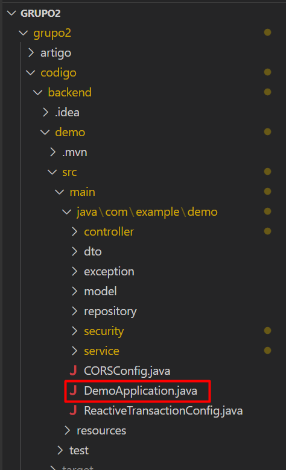
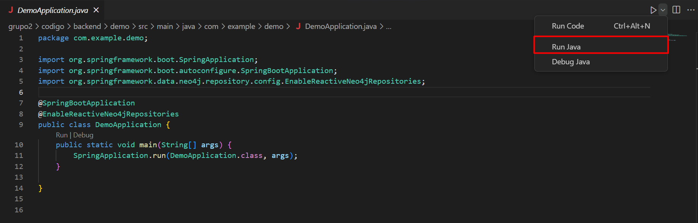
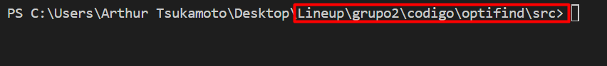
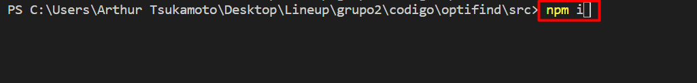
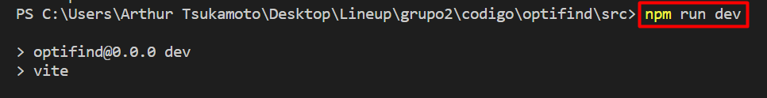
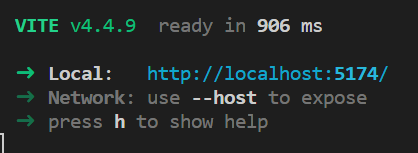

<table>
<tr>
<td>

</td>
<td>
</td>
</tr>
</table>

# Projeto: *OptiFind*

# Grupo: *LineUp*

# Integrantes:

- <a href="https://www.linkedin.com/in/arthur-nisa-de-paula-932746252/">Arthur Nisa de Paula Souza</a>
- <a href="https://www.linkedin.com/in/arthur-tsukamoto/">Arthur Tsukamoto</a>
- <a href="https://www.linkedin.com/in/bruno-wasserstein/">Bruno Wasserstein</a>
- <a href="https://www.linkedin.com/in/enya-oliveira-636566240/">Enya Oliveira Arruda</a>
- <a href="https://www.linkedin.com/in/estherhikari/">Esther Hikari Kimura Nunes</a>
- <a href="https://www.linkedin.com/in/guilherme-moura-9668821a5/">Guilherme Jesus Moura</a>

# Descrição

Em uma parceria entre o Inteli - Instituto de tecnologia e liderança e a empresa Rockwell Automation, foi selecionado uma necessidade de solução a ser feita por alunos do terceiro semestre do curso de ciência da computação. O projeto tinha como objetivo a criação de um software funcional e de fácil utilização para achar as melhores rotas entre dois pontos. A solução tinha que ser baseada em otimização matemática utilizando grafos, de modo que arestas fossem rotas relativas aos caminhos percorridos no mundo real e vértices representassem pontos de passagem do mundo físico.

# Documentação

A visualização da documentação está disponível no seguinte diretório: [/docs](/grupo2\docs\index.md).

# Artigo

A visualização do artigo cientifico está disponivel no seguinte diretorio: [/artigo](/grupo2\artigo\artigo-grupoN.md). Um arquivo gerado no formato PDF deverá ser anexado a cada *release* do projeto.

# Configuração para desenvolvimento

Esta seção mostrará o passo a passo de como iniciar nossa aplicação:

**Primeiro Passo:**

Para rodar o backend, é necessário abrir o código em algum editor de código de sua preferência. No caso a seguir, será utilizado o Visual Studio Code.

Acesse o arquivo DemoApplication.java presente no diretório: `grupo2/codigo/backend/demo/src/main/java/com/example/demo/DemoApplication.java`
 e no próprio arquivo clique em "Run Java".

Com isso, o backend está em funcionamento.

**Segundo Passo:**

Para iniciar o frontend, abra o terminal e acesse a pasta optfind, presente no seguinte diretório: `grupo2/codigo/frontend/optifind/src`.
 . 

Dentro da pasta digite "npm i" para baixar as depedências necessárias.

Com as depedências baixadas, podemos rodar o frontend utilizando o seguinte comando "npm run dev" no terminal do mesmo diretório.

Dessa forma, terminamos o procedimento para iniciar tanto o frontend, quanto o backend da nossa plataforma.

# Release - Tags

Linha do tempo dividido por Sprints.

* <a href="https://github.com/2023M5T5-Inteli/grupo2/releases/tag/Sprint_1" target="_blank">Sprint 1 - 01/08/2023 → 14/08/2023</a> 
  * Entendimento da Experiência do Usuário; 
  * Entendimento de Negócio; 
  * Entendimento do Contexto do Problema: Modelagem e representação 
* <a href="https://github.com/2023M5T5-Inteli/grupo2/releases/tag/Sprint_2" target="_blank">Sprint 2 - 15/08/2023 → 25/08/2023</a>  
  * Entendimento do Contexto do Problema; 
  * Gerenciamento do Grafo; 
  * Artigo - Versão Inicial; 
  * Repositório de Código da Aplicação 
* <a href="https://github.com/2023M5T5-Inteli/grupo2/releases/tag/Sprint_3_New" target="_blank">Sprint 3 - 26/08/2023 → 10/09/2023</a>  
  * Back-end da Aplicação; 
  * Front-end da Aplicação; 
  * Artigo - Motivação, Metodologia e Revisão Bibliográfica; 
  * Repositório de Código da Aplicação 
* <a href="https://github.com/2023M5T5-Inteli/grupo2/releases/tag/Sprint_4_New" target="_blank">Sprint 4 - 11/09/2023 → 25/09/2023</a>  
  * Complexidade e Corretude do algoritmo; 
  * Aplicação Integrada; 
  * Repositório de Código da Aplicação; 
  * Artigos - Resultados e Conclusões 
* Sprint 5 - 26/09/2023 --> 06/10/2023  
  * Refinamento da Aplicação; 
  * Artigo Completo; 
  * Apresentação Final; 
  * Refinamento e Validação dos Artefatos de Negócio 

## Licença

LineUp by Arthur Tsukamoto, Arthur Nisa, Bruno Wasserstein, Enya Oliveira, Esther Hikari, Guilherme Jesus and Inteli is licensed under <a href="http://creativecommons.org/licenses/by/4.0/?ref=chooser-v1" target="_blank" rel="license noopener noreferrer" style="display:inline-block;">Attribution 4.0 International</a>
