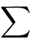
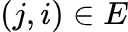
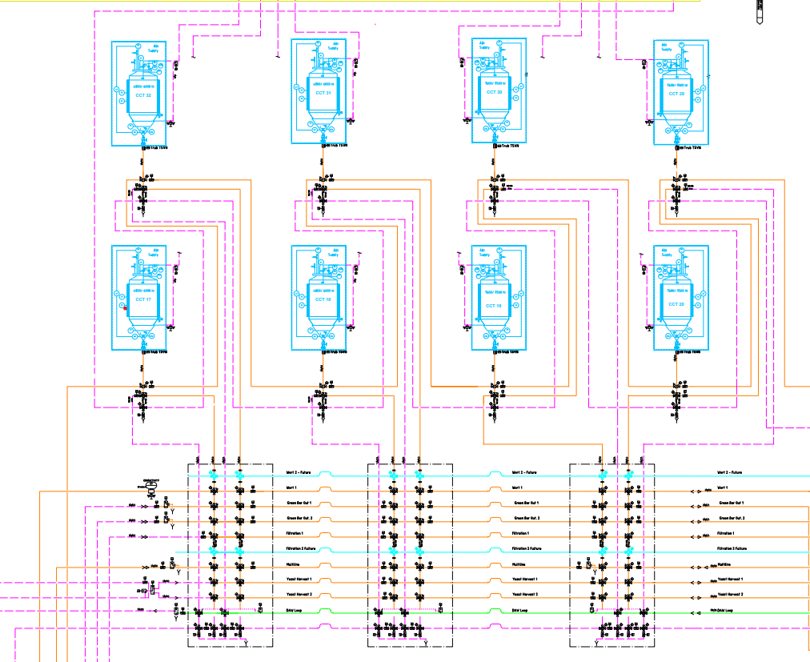
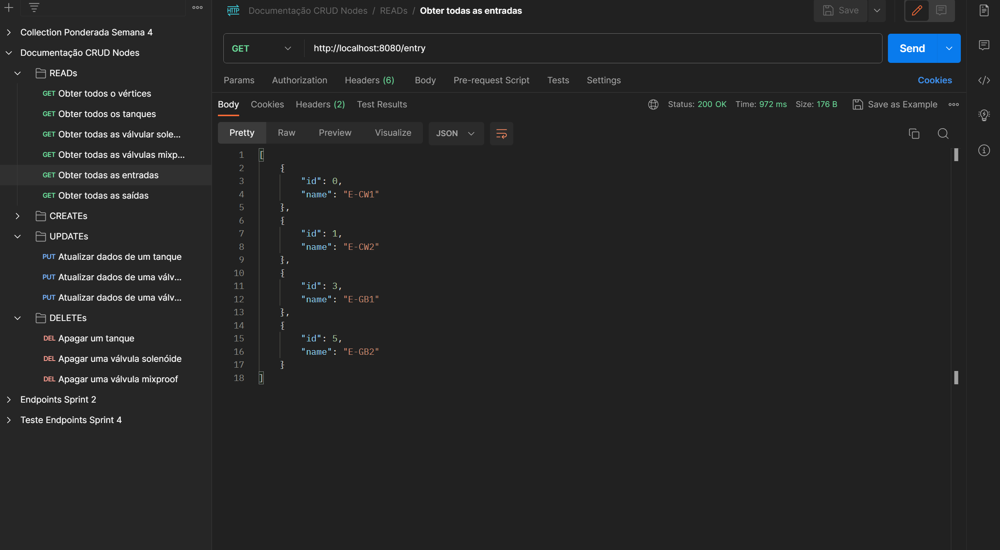

<table>
<tr>
<td>
<a href= "https://www.rockwellautomation.com/pt-br.html"></a>
</td>
<td><a href= "https://www.inteli.edu.br/"></a>
</td>
</tr>
</table>
<font size="+12"><center>
Optifind </center></font>


**Conteúdo**

- [Autores](#autores)
- [Visão Geral do Projeto](#visão-geral-do-projeto)
  - [Empresa](#empresa)
  - [O Problema](#o-problema)
  - [Objetivos](#objetivos)
    - [Objetivos Gerais](#objetivos-gerais)
    - [Objetivos Específicos](#objetivos-específicos)
- [Modelagem do Problema](#modelagem-do-problema)
  - [Dados Disponíveis](#dados-disponíveis)
  - [Objetivo do Problema](#objetivo-do-problema)
  - [Representação Visual (Neo4j)](#representação-visual-neo4j)
  - [Variáveis de Decisão](#variáveis-de-decisão)
  - [Limitações](#limitações)
  - [Modelagem Matemática](#modelagem-matemática)
    - [Tomada de Decisão](#tomada-de-decisão)
    - [Função Objetivo](#função-objetivo)
    - [Restrições](#restrições)
      - [Restrição da Bidirecionalidade:](#restrição-da-bidirecionalidade)
      - [Restrição de Continuidade:](#restrição-de-continuidade)
      - [Restrição da capacidade de vazão:](#restrição-da-capacidade-de-vazão)
  - [Cenários factíveis](#cenários-factíveis)
    - [Cenário 1](#cenário-1)
    - [Cenário 2](#cenário-2)
- [Entendimento do Negócio](#entendimento-do-negócio)
  - [Contexto da Indústria](#contexto-da-indústria)
  - [5 Forças de Porter](#5-forças-de-porter)
    - [Rivalidade entre concorrentes:](#rivalidade-entre-concorrentes)
    - [Poder de barganha dos fornecedores:](#poder-de-barganha-dos-fornecedores)
    - [Poder de barganha dos compradores:](#poder-de-barganha-dos-compradores)
    - [Ameaça de novos entrantes:](#ameaça-de-novos-entrantes)
    - [Ameaça de Produtos ou Serviços Substitutos:](#ameaça-de-produtos-ou-serviços-substitutos)
  - [Descriçao da Solução:](#descriçao-da-solução)
    - [Qual o problema a ser resolvido](#qual-o-problema-a-ser-resolvido)
    - [Qual a solução proposta](#qual-a-solução-proposta)
    - [Como a solução proposta deverá ser utilizada](#como-a-solução-proposta-deverá-ser-utilizada)
    - [Quais os benefícios trazidos pela solução proposta](#quais-os-benefícios-trazidos-pela-solução-proposta)
    - [Critério de Sucesso](#critério-de-sucesso)
  - [Matriz SWOT](#matriz-swot)
  - [Proposta de Valor: Canvas Value Proposition](#proposta-de-valor-canvas-value-proposition)
  - [Matriz de Risco](#matriz-de-risco)
  - [Persona](#persona)
  - [User Stories](#user-stories)
  - [Documentação da API](#documentação-da-api)
    - [Figura 1: Endpoint para obter todos os nós do grafo :](#figura-1-endpoint-para-obter-todos-os-nós-do-grafo-)
    - [Figura 2: Endpoint para obter todos os nós vizinhos.](#figura-2-endpoint-para-obter-todos-os-nós-vizinhos)
    - [Figura 3: Endpoint para obter todos usuários:](#figura-3-endpoint-para-obter-todos-usuários)
    - [Figura 4: Endpoint para obter todos projetos:](#figura-4-endpoint-para-obter-todos-projetos)
    - [Figura 5: Endpoint para obter  todas as arestas:](#figura-5-endpoint-para-obter--todas-as-arestas)
    - [Figura 6: Endpoint para criar um  nó:](#figura-6-endpoint-para-criar-um--nó)
    - [Figura 7: Endpoint para criar um usuário](#figura-7-endpoint-para-criar-um-usuário)
    - [Figura 8: Endpoint para criar um projeto:](#figura-8-endpoint-para-criar-um-projeto)
    - [Figura 9: Endpoint para criar uma aresta entre nós:](#figura-9-endpoint-para-criar-uma-aresta-entre-nós)
    - [Figura 10: Endpoint para atualizar um nó:](#figura-10-endpoint-para-atualizar-um-nó)
    - [Figura 11: Endpoint para atualizar um usuário:](#figura-11-endpoint-para-atualizar-um-usuário)
    - [Figura 12: Endpoint para atualizar um projeto:](#figura-12-endpoint-para-atualizar-um-projeto)
    - [Figura 13: Endpoint para remover um nó:](#figura-13-endpoint-para-remover-um-nó)
    - [Figura 14: Endpoint para remover usuário:](#figura-14-endpoint-para-remover-usuário)
    - [Figura 15: Endpoint para remover um projeto:](#figura-15-endpoint-para-remover-um-projeto)
    - [Figura 16: Endpoint para remover uma aresta entre nós:](#figura-16-endpoint-para-remover-uma-aresta-entre-nós)
    - [Figura 17: Endpoint para autenticar um usuário:](#figura-17-endpoint-para-autenticar-um-usuário)
    - [Figura 18: Endpoint para criar nós a partir de um csv:](#figura-18-endpoint-para-criar-nós-a-partir-de-um-csv)
    - [Figura 19: Endpoint para criar arestas a partir de um csv:](#figura-19-endpoint-para-criar-arestas-a-partir-de-um-csv)
    - [Figura 20: Endpoint para fazer o download do excel com o caminho minímo.](#figura-20-endpoint-para-fazer-o-download-do-excel-com-o-caminho-minímo)
  - [Documentação Frontend Integrado](#documentação-frontend-integrado)
    - [Login](#login)
    - [Grafo](#grafo)
  - [Referências:](#referências)


# Autores

- <a href="https://www.linkedin.com/in/arthur-nisa-de-paula-932746252/">Arthur Nisa de Paula Souza</a>
- <a href="https://www.linkedin.com/in/arthur-tsukamoto/">Arthur Tsukamoto</a>
- <a href="https://www.linkedin.com/in/bruno-wasserstein/">Bruno Wasserstein</a>
- <a href="https://www.linkedin.com/in/enya-oliveira-636566240/">Enya Oliveira Arruda</a>
- <a href="https://www.linkedin.com/in/estherhikari/">Esther Hikari Kimura Nunes</a>
- <a href="https://www.linkedin.com/in/guilherme-moura-9668821a5/">Guilherme Jesus Moura</a>
  

# Visão Geral do Projeto

## Empresa

A Rockwell Automations é a fusão entre duas empresas americanas: a Allen-Bradley, fundada em 1906 por Lynde Bradley e pelo Dr. Stanton Allen, já a empresa Rockwell International foi criada em 1973 pelo americano Willard Rockwell. A história centenária da Allen-Bradley iniciou-se no final da 2ª Revolução Industrial nos EUA (Estados Unidos da América) em 1901, com a invenção do reostato de compressão, utilizado para controlar a velocidade de motores elétricos.

Por volta de 1917, durante o meio/final da 1ª Guerra Mundial, houve um aumento significativo do interesse por rádios. Esse aumento na procura por rádios levou ao crescimento da demanda por reostatos, o que por sua vez ocasionou um aumento nos lucros da empresa e impulsionou sua expansão fabril. Entre os anos de 1930 e 1949, os engenheiros da Allen-Bradley desenvolveram resistores fixos moldados a calor, um componente que teve um papel crucial na revolução da era dos eletrônicos, sendo utilizado em dispositivos como walkie-talkies, radares e até mesmo aviões de guerra. Adicionalmente, alguns resistores da Allen-Bradley foram fundamentais na criação e fornecimento de energia para o UNIVAC, um dos primeiros computadores do mundo, que foi criado em 1951.

Durante a década de 60 e 80, os componentes da Allen-Bradley foram utilizados pela NASA (National Aeronautics and Space Administration), tanto na missão Apollo 11 em 1969 quanto no ônibus espacial americano em 1981. Apenas em 1985, a empresa foi comprada pela Rockwell International pelo valor de 1.651 bilhões de dólares.

Assim como a Allen-Bradley, a Rockwell International também atuava nos setores aeroespacial e de manufatura. Foi fundada em 1973 por meio da junção das empresas Rockwell Manufacturing e North American Rockwell. No auge, a empresa possuía 27 bilhões de dólares em vendas e empregava mais de 100 mil funcionários. Em 2001, 16 anos após a compra da Allen-Bradley pela Rockwell International, ocorreu o desmembramento da empresa, dando origem à Rockwell Automations como organização matriz.

Atualmente, a Rockwell Automations é uma empresa de capital aberto na bolsa de valores de Nova York, e é reconhecida como a maior empresa do setor de automação industrial. Adicionalmente, possui um valor de mercado próximo a 38.5 bilhões de dólares e conta com cerca de 26.000 funcionários em suas operações ao redor do mundo. Devido ao crescente interesse nas medidas ESG (Environmental, Social, and Governance), a empresa está direcionando investimentos significativos em ações de sustentabilidade. Nesse sentido, um dos principais objetivos é alcançar a neutralidade de carbono até o ano de 2030.

## O Problema

Atualmente, a definição da rota ideal dentro de uma cervejaria é feita de forma manual, limitada em flexibilidade e adaptada especificamente para cada adega. Quando ocorre um aumento ou diminuição na adega, com a adição ou remoção de tanques de fermentação, tanques de maturação, válvulas ou tubulações, torna-se necessário recalcular a rota, o que acarreta em gastos de tempo e dinheiro.

## Objetivos

### Objetivos Gerais

O objetivo geral é a criação de uma solução modular e flexível que ajude na definição de rotas otimizadas, utilizando a modelagem em grafos.

### Objetivos Específicos

O objetivo específico deste projeto é a criação de uma ferramenta padronizada, flexível e reutilizável que permita receber informações dos tanques de maturação, tanques de fermentação, válvulas e tubulações. Adicionalmente, visa-se modelar todas as rotas possíveis e selecionar a melhor rota da cerveja nas etapas de fermentação e maturação dentro de uma adega, com a finalidade de minimizar os custos e tempo de produção.

# Modelagem do Problema

O cenário apresentado trata de um desafio relacionado a automação industrial, mais especificamente no reconhecimento e otimização das rotas de transporte de líquidos em um ambiente de produção, nesse caso uma cervejaria.
Atualmente, a análise dessas rotas utiliza soluções pouco flexíveis. Isso implica que, ao ajustar ou criar novas rotas de tubulações e tanques para o transporte do mosto, é necessário realizar um processo complexo e intensivo para cada mudança. Esse processo pode ser ineficiente, demorado e propenso a erros humanos.

## Dados Disponíveis

Para encontrar a melhor solução para esse problema, tivemos acesso aos diagramas P&ID que mostram as conexões entre os tanques e as válvulas na cervejaria. Esses diagramas nos mostram como os processos são interligados em cada etapa da produção de cerveja, como fermentação e maturação. Eles também fornecem informações sobre os 32 tanques, cada um desempenhando ambas as funções. Observamos onde os tanques estão localizados, suas conexões com válvulas e bombas, e como isso varia ao longo das etapas de preparo do mosto, incluindo seus diferentes estados (wort e green ber).
Com base nessas informações, criamos um modelo inicial de um grafo, que nos permite identificar todas as possíveis rotas. Assim buscando a solução mais eficiente para o problema.

## Objetivo do Problema

A raiz do problema está na necessidade de encontrar uma abordagem mais eficiente e flexível de calcular as rotas com base nos dados de um diagrama. A solução ideal, utilizando a modelagem de grafos, deve ser capaz de lidar com diferentes configurações de tubulações e tanques de forma automatizada, utilizando os dados do diagrama para descobrir todas as rotas entre um ponto de partida e um ponto de chegada definidos pelo usuário. Consequentemente, reduzindo o tempo necessário para adaptar o sistema às mudanças na produção, acelerando o processo e diminuindo a ocorrência de erros humanos.

## Representação Visual (Neo4j)

Para aprimorar a eficácia na representação do problema, optou-se pela utilização de grafos como estrutura central na representação do diagrama. Nesse contexto, o Neo4j foi a ferramenta ideal para facilitar essa visualização. O código empregado na criação do grafo visto abaixo, encontra-se disponível para acesso <a href="https://github.com/2023M5T5-Inteli/grupo2/blob/main/codigo/grafos/neo.cypher">aqui</a>.


Este grafo ilustra de forma abrangente todas as possíveis rotas entre um ponto e outro da tubulação. Na elaboração deste grafo, foram criteriosamente incorporados elementos como válvulas, pontos de entrada, pontos de saída e tanques, os quais desempenham o papel de nós fundamentais que o mosto atravessa, e que têm o potencial de influenciar a trajetória do fluxo. As arestas introduzidas representam todas as conexões interligando esses nós. Além disso, as propriedades de cada nó foram levadas em consideração, uma vez que essas características exercem influência no comportamento do mosto ao se traçar uma rota. Como resultado, obtemos uma visão abrangente de todas as vias que o líquido pode percorrer para alcançar qualquer ponto dentro do diagrama.

## Variáveis de Decisão

O principal desafio na otimização das rotas de transporte está relacionado às características do encanamento, que influenciam diretamente as sugestões do algoritmo, já que algumas rotas podem estar ocupadas em determinados momentos e desocupadas em outros. Portanto, é de extrema importância levar em consideração variáveis como a capacidade da tubulaçao, os pontos de entrada e saída do mosto, a capacidade tanto do sistema quanto dos reservatórios, além do número de percursos potenciais por meio das válvulas até os tanques de fermentação/maturação. Isso permite a alternância entre as rotas, ou seja, enquanto a melhor rota está em uso, outra rota pode ser percorrida simultaneamente.

## Limitações
  As limitações do projeto estão principalmente ligadas à parte mecânica das rotas de produção. Isso se deve ao uso de diferentes tipos de válvulas para controlar o fluxo do mosto. Cada tipo de válvula tem funções específicas, como bloquear o fluxo em certos caminhos (como as válvulas solenoides) ou redirecionar o mosto (como as válvulas mixproof). Essas características das válvulas introduzem complexidade no desenvolvimento e na otimização das rotas de produção.

  Além disso, uma limitação fundamental deste modelo é a capacidade máxima de fluxo suportada por cada tubulação e válvula. Essa restrição é crítica, pois pode impactar diretamente na eficácia das soluções propostas. A necessidade de garantir que o sistema não exceda esses limites de capacidade de fluxo adiciona uma camada adicional de desafio à concepção e operação das rotas de produção.

  Portanto, é fundamental levar em consideração não apenas a complexidade das válvulas, mas também as restrições de capacidade de fluxo ao abordar as limitações deste modelo, pois isso tem implicações significativas na eficácia e na segurança das operações.

## Modelagem Matemática

Com o intuito de representar a modelagem matemática do problema, será utilizado uma parte do grafo apresentado na seção "Representação Visual neo4j".


No grafo, os nós vermelhos representam as válvulas MixProof, os azuis representam as válvulas Solenoides e os nós marrons simbolizam os tanques de fermentação/maturação. Enquanto que a ligação entre diferentes nós refere-se à tubulação da cervejaria. Como não possuímos informações sobre a distância de um nó até outro, iremos utilizar-se de dados sintéticos para facilitar o entendimento da modelagem matemática.

| Distância | Nó de Origem | Nó de Destino |
|:---------:|:------------:|:------------:|
|   5.40    |   QI1-MP1     |   QI1-MP2    |
|   4.00    |   QI1-MP2     |   QI1-MP3    |
|  15.00    |   QI1-MP3     |   QI1-MP4    |
|  13.60    |   QI1-MP4     |   QI1-MP5    |
|   8.10    |   QI1-MP5     |   QI1-MP6    |
|  13.50    |   QI1-MP1     |   QI1-MP7    |
|  14.00    |   QI1-MP2     |   QI1-MP8    |
|   5.60    |   QI1-MP3     |   QI1-MP9    |
|  12.50    |   QI1-MP4     |   QI1-MP10   |
|  13.00    |   QI1-MP5     |   QI1-MP11   |
|   5.40    |   QI1-MP6     |   QI1-MP12   |
|  14.70    |   QI1-MP7     |   QI1-MP8    |
|   3.70    |   QI1-MP8     |   QI1-MP9    |
|   6.00    |   QI1-MP9     |   QI1-MP10   |
|   2.20    |   QI1-MP10    |   QI1-MP11   |
|   1.40    |   QI1-MP11    |   QI1-MP12   |
|  13.00    |   QI1-MP7     |   QI1-S1     |
|   5.40    |   QI1-MP8     |   QI1-S2     |
|   2.00    |   QI1-MP9     |   QI1-S3     |
|   8.50    |   QI1-MP10    |   QI1-S4     |
|   1.40    |   QI1-MP15    |   QI1-S5     |
|  12.80    |   QI1-MP16    |   QI1-S6     |
|   2.30    |   QI1-MP17    |   QI1-S7     |
|   1.50    |   QI1-MP18    |   QI1-S8     |
|   7.00    |   QI1-MP13    |   QI1-S1     |
|  10.00    |   QI1-MP14    |   QI1-S2     |
|   9.65    |   QI1-S3      |   QI1-S5     |
|  11.52    |   QI1-S4      |   QI1-S6     |
|   7.30    |   QI1-MP11    |   QI1-S7     |
|   3.60    |   QI1-MP12    |   QI1-S8     |
|  14.50    |   QI1-MP13    |   QI1-MP14   |
|   4.23    |   QI1-MP14    |   QI1-MP15   |
|   7.10    |   QI1-MP15    |   QI1-MP16   |
|   4.00    |   QI1-MP16    |   QI1-MP17   |
|   3.10    |   QI1-MP17    |   QI1-MP18   |
|   5.00    |   QI1-MP13    |   QI1-MP19   |
|   9.72    |   QI1-MP14    |   QI1-MP20   |
|   3.00    |   QI1-MP15    |   QI1-MP21   |
|   1.20    |   QI1-MP16    |   QI1-MP22   |
|   4.15    |   QI1-MP17    |   QI1-MP23   |
|   2.00    |   QI1-MP18    |   QI1-MP24   |
|  12.26    |   QI1-MP19    |   QI1-MP20   |
|  14.27    |   QI1-MP20    |   QI1-MP21   |
|   6.42    |   QI1-MP21    |   QI1-MP22   |
|   3.35    |   QI1-MP22    |   QI1-MP23   |
|   1.44    |   QI1-MP23    |   QI1-MP24   |
|   1.55    |   QI1-MP19    |   QI1-S9     |
|   7.90    |   QI1-MP20    |   QI1-S10    |
|   4.70    |   QI1-MP21    |   QI1-S11    |
|   6.84    |   QI1-MP22    |   QI1-S12    |
|   2.11    |   QI1-MP27    |   QI1-S13    |
|  12.80    |   QI1-MP28    |   QI1-S14    |
|   2.70    |   QI1-MP29    |   QI1-S15    |
|   7.33    |   QI1-MP30    |   QI1-S16    |
|   3.18    |   QI1-MP25    |   QI1-S9     |
|   5.25    |   QI1-MP26    |   QI1-S10    |
|  12.40    |   QI1-S11     |   QI1-S13    |
|   5.69    |   QI1-S12     |   QI1-S14    |
|   2.96    |   QI1-MP23    |   QI1-S15    |
|  12.11    |   QI1-MP24    |   QI1-S16    |
|   7.74    |   QI1-MP25    |   QI1-MP26   |
|   3.66    |   QI1-MP26    |   QI1-MP27   |
|   1.20    |   QI1-MP27    |   QI1-MP28   |
|   9.26    |   QI1-MP28    |   QI1-MP29   |
|  12.31    |   QI1-MP29    |   QI1-MP30   |
|  11.00    |   QI1-MP25    |   QI1-MP31   |
|  14.94    |   QI1-MP26    |   QI1-MP32   |
|   2.59    |   QI1-MP27    |   QI1-MP33   |
|   5.13    |   QI1-MP28    |   QI1-MP34   |
|   5.62    |   QI1-MP29    |   QI1-MP35   |
|  14.57    |   QI1-MP30    |   QI1-MP36   |
|  12.51    |   QI1-MP31    |   QI1-MP32   |
|   9.52    |   QI1-MP32    |   QI1-MP33   |
|   4.51    |   QI1-MP33    |   QI1-MP34   |
|   3.02    |   QI1-MP34    |   QI1-MP35   |
|   1.20    |   QI1-MP35    |   QI1-MP36   |
|   4.20    |   QI1-MP31    |   QI1-S17    |
|   3.04    |   QI1-MP32    |   QI1-S18    |
|  12.71    |   QI1-MP33    |   QI1-S19    |
|   7.17    |   QI1-MP34    |   QI1-S20    |
|   6.47    |   QI1-MP1     |   QI1-TMP1   |
|   8.59    |   QI1-MP7     |   QI1-TMP2   |
|  10.31    |   QI1-MP13    |   QI1-TMP3   |
|  11.02    |   QI1-MP19    |   QI1-TMP4   |
|   7.72    |   QI1-MP25    |   QI1-TMP5   |
|   8.50    |   QI1-MP31    |   QI1-TMP7   |
|  10.00    |   QI1-TMP5    |   QI1-TS1    |
|   3.32    |   QI1-TMP7    |   QI1-TS2    |
|   6.01    |   QI1-TMP6    |   QI1-TS1    |
|   1.42    |   QI1-TMP8    |   QI1-TS2    |
|   4.89    |   QI1-TMP1    |   QI1-T1     |
|   1.08    |   QI1-TMP2    |   QI1-T2     |
|  11.32    |   QI1-TMP3    |   QI1-T3     |
|   1.29    |   QI1-TMP4    |   QI1-T4     |
|   4.51    |   QI1-TMP5    |   QI1-T5     |
|   2.15    |   QI1-TMP6    |   QI1-T6     |
|   7.54    |   QI1-TMP7    |   QI1-T7     |
|   3.14    |   QI1-TMP8    |   QI1-T8     |


* Distância em metros.


### Tomada de Decisão

Para a tomada de decisão para o caminho minímo, podemos utilizar-se da seguinte variável:
```
X(i,j) {
1 - se o caminho for usado.
0 - caso o caminho não seja utilizado. 
}
```

Onde X representa as arestas entre um nó $i$ e um nó $j$. Em que:

```
i - nó de origem.
j - nó de destino.
```

### Função Objetivo

A função objetivo descreve a maneira pela qual a solução visa encontrar o caminho mais curto entre dois nós. O resultado desejado pode ser alcançado da seguinte forma:

```
Min C = 5.4X(MP1, MP2) + 4.0X(MP2, MP3) + 15X(MP3, MP4) + 13.6X(MP4, MP5) + 8.10X(MP5, MP6) + 13.5X(MP1, MP7) + 14.0X(MP2, MP8) + 5.6X(MP3, MP9) + 12.5X(MP4, MP10) + 13.0X(MP5, MP11) + 5.4X(MP6, MP12) + 14.7X(MP7, MP8) + 3.7X(MP8, MP9) + 6.0X(MP9, MP10) + 2.2X(MP10, MP11) + 1.4X(MP11, MP12) + 13X(MP7, S1) + 5.4X(MP8, S2) + 2.0X(MP9, S3) + 8.5X(MP10, S4) + 1.4X(MP15, S5) + 12.8X(MP16, S6) + 2.3X(MP17, S7) + 1.5X(MP18, S8) + 7.0X(MP13, S1) + 10.0X(MP14, S2) + 9.65X(S3, S5) + 11.52X(S4, S6) + 7.30(MP11, S7) + 3.6X(MP12, S8) + 14.5X(MP13, MP14) + 4.23X(MP14, MP15) + 7.10X(MP15, MP16) + 4.0X(MP16, MP17) + 3.1X(MP17, MP18) + 5.0X(MP13, MP19) + 9.72X(MP14, MP20) + 3.00X(MP15, MP21) + 1.20X(MP16, MP22) + 4.15X(MP17, MP23) + 2.00X(MP18, MP24) + 1.55X(MP19, S9) + 7.90X(MP20, S10) + 4.70X(MP21, S11) + 6.84X(MP22, S12) + 2.11X(MP27, S13) + 12.80X(MP28, S14) + 2.7X(MP29, S15) + 7.33X(MP30, S16) + 3.18X(MP25, S9) + 5.25X(MP26, S10) + 12.40X(S11, S13) + 5.69X(S12, S14) + 2.96x(MP23, S15) + 12.11X(MP24, S16) + 7.74X(MP25, MP26) + 3.66X(MP26, MP27) + 1.20X(MP27, MP28) + 9.26X(MP28, MP29) + 12.31X(MP29, MP30) + 11.00X(MP25, MP31) + 14.94X(MP26, MP32) + 2.59X(MP27, MP33) + 5.13X(MP28, MP34) + 5.62X(MP29, MP35) + 14.57X(MP30, MP36) + 12.51X(MP31, MP32) + 9.52X(MP32, MP33) + 4.51X(MP33, MP34) + 3.02X(MP34, MP35) + 12.71X(MP33, S19) + 7.17X(MP32, S20) + 6.47X(MP1, TMP1) + 8.59X(MP7, TMP2) + 10.31X(MP13, TMP3) + 11.02X(MP19, TMP4) + 7.72X(MP25, TMP5) + 8.50X(MP31, TMP7) + 10.00X(TMP5, TS1) + 3.32X(TMP7, TS2) + 6.01X(TMP8, TS1) + 1.42X(TMP8, TS2) + 5X(TMP1, T1) + 5X(TMP2, T2) + 5X(TMP3, T3) + 5X(TMP4, T4) + 5X(TMP5, T5) + 5X(TMP6, T6) + 5X(TMP7, T7) + 5X(TMP8, T8).
```
Para facilitar o entendimento da função, segue uma representação generalizada da fórmula:


Onde: 
<br>
: Representa o valor do menor caminho entre dois nós.
<br>
: A notação de somatório é usada para somar os termos que se seguem para todas as arestas no conjunto de arestas E que conectam um nó i até um nó j.
<br> 
: Refere-se a todas as arestas (i, j) no conjunto de arestas E do grafo. Em um grafo bidirecional, cada aresta permite o fluxo em ambas as direções, então   e  .
<br>
: É o peso da aresta entre os nós i e j. Responsável por representar a distância entre os nós i e j.
<br>
: É uma variável binária que é igual a 1 se a aresta (i, j) estiver no caminho selecionado, e 0 caso contrário.


### Restrições

#### Restrição da Bidirecionalidade:

A restrição ocorre quando as arestas podem estar em uma disposição de rotas de duas direções, ou seja, as arestas podem receber fluxos de ambas as direções. Dessa forma, se a aresta (i, j) estiver no caminho, a aresta (j, i) também estará.

**Expressão matemática:**


#### Restrição de Continuidade:

A restrição da continuidade garante que o fluxo entre nós seja contínuo, se o nó não for o nó de ponto de partida ou destino. Ou seja, se ele for parte da rota de passagem, se a rota entra no nó, deve sair dele. 


**Expressão matemática:**


*A segunda imagem indica os limites e exceções*

**Para todos os nós i no conjunto de vértices V, exceto os nós de partida e destino*

**Observação sobre exceções para essa restrição:**
* Espera-se que no nó de partida haja mais arestas saindo do que entrando, pois é o início do caminho.
* Espera-se que no nó de destino haja mais arestas entrando do que saindo, pois é o fim do caminho.

  
#### Restrição da capacidade de vazão:

A restrição de vazão refere-se a necessidade de ateção ao peso das arestas, pois isso impacta na capacidade do fluxo entre os nós. Os pesos suportados entre arestas pode variar.

*No caso da cervejaria, a vazão de um tanque não é necessariamente a mesma que a de todas as tubulações.*

**Expressão matemática:**


## Cenários factíveis

### Cenário 1

Para facilitar o entendimento de um possivel cenário, utilizaremos apenas 1 quadrante da fábrica(Quandrante Superior I).



Cenário de um processo complexo e controlado de fabricação de cerveja, onde cada componente desempenha um papel vital na qualidade e sabor do produto final.

1. Solenoide QS1-S20: Controla o fluxo de mosto (mistura de água, malte e lúpulo) para a próxima etapa.

2. Mixproofs QS1-MP34 a QS1-MP31: Essas válvulas direcionam o mosto através de diferentes tubulações, garantindo que não haja contaminação cruzada com outros líquidos.

3. Solenoide QS1-S9: Controla o fluxo para a etapa de fermentação, onde o fermento é adicionado.

4. Mixproofs QS1-MP19 a QS1-MP1: Direcionam a cerveja através das etapas de fermentação, maturação e filtração.

5. Tanque Mixproof QS1-TMP1: Um tanque especializado que permite a mistura segura de diferentes líquidos, como a adição de sabores ou outros ingredientes.

6. Tanque QS1-T1: O tanque final onde a cerveja é armazenada antes do envase.


**Representação geométrica do trajeto do cenário 1:**


Sendo D = Distância, e essa sendo a soma de todas as arestas percorridas:
 * D = 12.83+14.70+10.33+20.83+4.21+14.49+19.38+6.20+6.04+18.38+18.01 + 3.60+17.09 = 166.90


### Cenário 2

Para facilitar o entendimento de um possivel cenário, utilizaremos apenas 1 quadrante da fábrica(Quandrante Inferior I).


  Cenário de processo de fabricação de cerveja com controle maior de álcool

1. Início (Solenoide QI1-S20): O processo começa com o controle do fluxo de líquido através de um solenoide.
2. Válvula Mixproof QI1-MP34: O líquido é direcionado através desta válvula para mistura e controle.
3. Válvula Mixproof QI1-MP33: Continuação do controle de mistura.
4. Válvula Mixproof QI1-MP32: Mais controle e mistura.
5. Válvula Mixproof QI1-MP31: Continuação do processo de mistura.
6. Válvula Mixproof QI1-MP25: Controle adicional do fluxo.
7. Solenoide QI1-S9: Controle preciso do fluxo de líquido.
8. Válvula Mixproof QI1-MP19: Mistura adicional.
9. Tanque Mixproof QI1-TMP4: Armazenamento temporário.
10. Tanque Final QI1-T4: O líquido chega ao tanque final para fermentação e maturação especializada


**Representação geométrica do trajeto do cenário 2:**


Somando todas as arestas, a distância total será 136.39 metros

# Entendimento do Negócio

## Contexto da Indústria

A automação industrial refere-se à implementação de tecnologias e sistemas de controle com o propósito de aumentar a eficiência, produtividade, segurança e qualidade no setor fabril e manufatureiro. De acordo com uma pesquisa realizada pela Precedence Research sobre o uso de automação na indústria, estima-se que o mercado de automação atualmente valha cerca de 196.6 bilhões de dólares, com uma projeção de atingir até 412.8 bilhões de dólares até o ano de 2030. Grande parte desse crescimento se dá pela Ásia e pela Europa, os quais possuem 38% e 29% do market share, respectivamente, enquanto que a américa do norte detém 23%, e a américa latina com 6%. Os 4% restantes pertencem ao Oriente Médio e à África. Apesar da América do Norte estar apenas em terceiro lugar em relação a participação no mercado de automação, algumas das maiores empresas são dessa região. Exemplos notáveis incluem Rockwell Automation, Emerson Electric e Honeywell International.

Segundo o relatório financeiro anual de 2022 da Rockwell Automation, a empresa obteve um resultado líquido de 932 milhões de dólares, com vendas no valor de 7,760 bilhões de dólares. Seu modelo de negócio é dividido em três principais setores industriais para automação. O primeiro é a Discrete Industry (indústria discreta), que se dedica à manufatura de produtos únicos, como carros, roupas e eletrodomésticos. O segundo é a Hybrid Industry (indústria híbrida), responsável por processos de fluxo contínuo, permitindo maior flexibilidade de produção para se adaptar às necessidades dos clientes. Por fim, o terceiro setor é a Process Industry (indústria de processo), que engloba setores de produção em etapas, como a fabricação de medicamentos, bebidas, alimentos e produtos derivados do petróleo. Entre esses setores, os principais segmentos de produtos oferecidos pela Rockwell são Intelligent Devices (Aparelhos inteligentes), com 3.6 bilhões de dólares em vendas, seguido por Software, com 2.3 bilhões de dólares e o terceiro sendo Lifecycle Services, com 1.9 bilhões de dólares em vendas no ano de 2022.

No mercado de automação industrial, os principais players são:  Siemens, ABB, Rockwell e Emerson Process. A Siemens é a empresa de automação mais antiga do mundo, fundada há 176 anos em Berlim por Werner von Siemens e Johann Georg Halske, com cerca de 311 mil funcionários e um resultado líquido de 4.83 bilhões de dólares estadunidenses no ano de 2022. Já a ABB é uma empresa suíça, resultado da fusão de duas empresas (ASEA e BBC) em 1988, ela possui cerca de 105 mil funcionários e obteve um resultado líquido de 2.47 bilhões de dólares. Do outro lado do oceano, nos EUA, temos a Rockwell Automations, junção de duas empresas, a Allen-Bradley fundada em 1906 e pela Rockwell International criada em 1973. Atualmente, a empresa possui 26 mil funcionários ao redor do mundo e conseguiu um resultado líquido de 932 milhões de dólares. Por fim, a última empresa é a Emerson Process, outra empresa norte-americana, fundada em 1890 por John Wesley Emerson, a empresa obteve um resultado líquido de 3 bilhões e 230 milhões de dólares com 85 mil pessoas empregadas. Dessa forma, é perceptível que o setor de automação possui bastante competitividade entre as empresas.

Com a crescente demanda por automação em todo o mundo, empresas líderes no setor, como a Rockwell, Siemens e ABB, estão realizando investimentos significativos em pesquisa e desenvolvimento de novas tecnologias, incluindo IoT , Inteligência Artificial, Realidade Aumentada, Realidade Virtual e segurança da informação. O principal objetivo dessas tecnologias é impulsionar a indústria de automação ao máximo, aumentando a eficiência, o fluxo de trabalho e a produtividade nas indústrias. Além disso, a adoção dessas tecnologias torna o ambiente de trabalho mais seguro para os funcionários, como no caso do uso de inteligência artificial para manutenção preditiva de máquinas. Portanto, as principais tendências para o setor de automação industrial estão relacionadas à Inteligência Artificial, IoT, Realidade Aumentada, Realidade Virtual e Segurança da informação.

## 5 Forças de Porter

As 5 Forças de Porter permitem uma avaliação e análise setorial que possibilita entender o nível de competitividade de um mercado. Criado por Michael Porter na década de 1970, esse framework ainda é amplamente estudado e aplicado no planejamento estratégico das empresas.
Essa análise é composta por:

Rivalidade entre Concorrentes: Refere-se à competição direta entre empresas que oferecem produtos ou serviços semelhantes no mesmo mercado.

Poder de Barganha dos Fornecedores: Relaciona-se com a capacidade dos fornecedores de influenciar os preços e as condições de fornecimento.

Poder de Barganha dos Compradores: Reflete a capacidade dos compradores de negociar preços e condições de compra.

Ameaça de Novos Entrantes: Avalia o potencial de novas empresas entrarem no mercado, considerando barreiras como capital necessário, tecnologia, regulamentações, entre outros.

Ameaça de Produtos ou Serviços Substitutos: Analisa a possibilidade de produtos ou serviços alternativos substituírem os atuais, afetando a demanda.

### Rivalidade entre concorrentes:
**Nível de rivalidade: Muito alto** \
O setor de automação industrial é muito competitivo, com uma ampla aplicação e diferentes formas de desenvolvimento de soluções. A Rockwell Automation enfrenta uma forte concorrência de empresas globais bem estabelecidas como Honeywell International, KUKA, Hexagon, Hubbell, Emerson, Siemens Global, Synopsys, ABB, OMRON, Roper Technologies, Yaskawa Electric e Shanghai Electric.
A empresa busca se diferenciar por meio de inovação, qualidade e sustentabilidade, mas enfrenta desafios em termos de crescimento de renda em comparação com seus concorrentes, com um crescimento de renda líquida de 33,27% no 2º trimestre de 2023.


### Poder de barganha dos fornecedores:
**Nível do poder de barganha dos fornecedores: Alto** \
A aplicação de automação industrial e o monitoramento dependem de sensores, microcontroladores e sistemas mais robustos, resultando em uma grande dependência de fabricantes de semicondutores. Como existem poucos fornecedores de semicondutores, o poder de barganha deles é alto. A Rockwell Automation pode enfrentar desafios em termos de preços, qualidade e disponibilidade desses componentes essenciais.

### Poder de barganha dos compradores:
**Nível do poder de barganha dos compradores: Muito alto** \
Devido à existência de muitos concorrentes no mercado, o poder de barganha dos compradores é muito elevado. Os compradores têm várias opções de fornecedores para escolher, o que lhes dá uma posição de negociação forte. Eles podem pressionar a Rockwell Automation para fornecer produtos e serviços de alta qualidade a preços competitivos.

### Ameaça de novos entrantes:
**Nível de ameaça de novos entrantes: Médio** \
A entrada no setor de automação industrial requer um alto nível de conhecimento e investimentos consideráveis em tecnologia e pesquisa. Além disso, a necessidade de estabelecer relações com fornecedores e clientes (networking) pode dificultar a entrada de novos concorrentes. No entanto, a abundância de material de consulta e ensino na área pode facilitar a formação de profissionais especializados, tornando a entrada no mercado mais acessível para novas empresas.

### Ameaça de Produtos ou Serviços Substitutos:
**Nível de Ameaça de Produtos ou Serviços Substitutos: Baixo** \
A Rockwell Automation investe muito em pesquisa e tecnologia, atualizando-se constantemente. Isso dificulta a substituição ou ameaça real de substitutos, pois a empresa se esforça para estar na vanguarda da inovação e qualidade em automação industrial. A ameaça de um substituto é baixa se ele não oferecer uma relação atraente entre preço e desempenho em comparação com o produto da indústria, especialmente se o custo do comprador de mudar para o substituto for alto.

## Descriçao da Solução:

### Qual o problema a ser resolvido
Atualmente, a definição da rota ideal dentro de uma cervejaria é feita de forma manual, limitada em flexibilidade e adaptada especificamente para cada adega. Quando ocorre um aumento na adega, com a adição de novos tanques, válvulas ou tubulações, torna-se necessário recalcular a rota, o que acarreta em gastos de tempo e dinheiro.


### Qual a solução proposta
No desenvolvimento do projeto com a rockwell automation, a solução proposta foi de automatizar o processo para o mapeamento das rotas durante a produção de uma cerveja, levando em consideração todos os trajetos e as condições implicadas, é essencial considerar a perspectiva de negócios para garantir que o projeto alcance seus objetivos de eficiência e lucratividade, desenvolvendo um trabalho inovador e estratégico que possibilitará uma visão holística das operações.

### Como a solução proposta deverá ser utilizada
Estamos desenvolvendo uma solução moldada nas necessidades do cliente, uma interface intuitiva e fácil de manusear para que a integração estratégica possibilite a maximização dos seus benefícios à empresa. 
O usuário, que nos entregou uma planta com tudo que precisamos considerar para as rotas, receberá um output contendo todas as informações necessárias para entender o melhor caminho a ser feito com base nas condições propostas.

### Quais os benefícios trazidos pela solução proposta
A solução proposta oferece benefícios significativos, destacando-se o ganho de tempo e a melhoria na qualidade do desenvolvimento. Com a capacidade de ser aplicada em cervejarias de qualquer tamanho, a ferramenta otimiza o processo de seleção da melhor rota, eliminando a necessidade de cálculos manuais e reduzindo consideravelmente o tempo necessário para realizar essa tarefa, também  possibilitará uma visão holística das operações que implicará em tomadas de decisões mais eficazes.
Além disso, superar algumas limitações mecânicas, alinhando os objetivos de crescimento com a eficiência, sendo mais volátil e adaptável.

### Critério de Sucesso
Uma vez que a ferramenta foi desenvolvida, o sucesso será avaliado através de simulações ou testes utilizando uma planta de adega fictícia. Durante essas avaliações, serão feitas comparações detalhadas entre todas as rotas possíveis, buscando identificar aquela que apresenta a menor distância, menor tempo de percurso e alcança uma velocidade satisfatória. Essa abordagem permitirá verificar de forma mais fluída e precisa a eficácia da solução, garantindo que o sistema otimize o processo de escolha da melhor rota e atenda às necessidades de forma ágil e eficiente.

## Matriz SWOT

A matriz SWOT (Strengths, Weaknesses, Opportunities, Threats) é uma ferramenta de análise estratégica que ajuda a avaliar as forças, fraquezas, oportunidades e ameaças de uma organização. Ela auxilia na identificação de direções estratégicas, tomada de decisões e planejamento, destacando fatores internos e externos que podem impactar o desempenho da empresa.


## Proposta de Valor: Canvas Value Proposition
Canvas Value Proposition é uma ferramenta estratégica feita com o objetivo de criar propostas de valor eficazes. Ela divide a análise em Perfil do Cliente e Mapa de Valor, conectando as necessidades do cliente com as soluções que são oferecidas. Isso leva a uma compreensão mais profunda do mercado e a ajustes que impulsionam o sucesso nos negócios.


## Matriz de Risco

Uma matriz de risco é uma ferramenta utilizada para avaliar e priorizar riscos com base na probabilidade de ocorrência e no impacto potencial. Ela fornece uma representação visual dos riscos, permitindo que as organizações identifiquem quais riscos necessitam de atenção imediata e quais podem ser monitorados com menos urgência.


## Persona

Uma persona é, em resumo, uma forma de representar ficticiamente o cliente ideal de uma empresa ou o usuário ideal de um sistema, baseada em dados reais sobre o comportamento e características desse cliente ou usuário.

Mapear uma persona pode trazer várias vantagens para o negócio, produto ou sistema, como entender os comportamentos do púbico ideal. Isso permite que a empresa saiba exatamente onde encontrar o seu público ideal, criando estratégias mais assertivas.

Para se criar uma persona deve-se mapear os principais comportamentos e características do cliente, como idade, gênero, interesses, hábitos de compra, e preferências de comunicação. Ao fazer isso é possível humanizar a persona e torná-la mais tangível para a equipe de marketing.

O objetivo na criação de uma persona é enxergar pela visão do usuário final da solução como ela realmente vai impactar e otimizar suas funções do dia dia, para isso, pensar em suas dores é muito importante, nesse projeto, levamos em consideração um técnico de automação industrial como nossa persona principal, suas dores são refletidas pela necessidade de recalcular novas rotas manualmente sempre que há alguma mudança, a baixa flexibilidade custa muito tempo e esforço lógico.


## User Stories


Uma user story pode ser descrita como uma frase curta e direta sobre uma funcionalidade do sistema, ela é escrita sob a perspectiva do que o usuário deseja e é utilizada para informar e inspirar as decisões e modelagem do sistema.

Criar uma user story é importante por diversas razões, como compreensão compartilhada por parte de todos os envolvidos no projeto, flexibilidade e orientação para o usuário final.

Para o nosso projeto, criamos as seguintes user stories para nos ajudar a entender mais do problema e esquematizar uma solução completa e eficaz: 

- Eu, como técnico de automação industrial, necessito criar rotas otimizadas para a produção de cerveja em um curto período de tempo, para que eu possa aumentar a eficiência do processo de produção e consiga reduzir os custos associados.
- Eu como técnico de automação industrial, desejo que o sistema suporte uma importação de diagrama P&ID para que eu não precise digitar todas as possíveis rotas manualmente.
- Eu, como técnico de automação industrial, desejo que ele gere automaticamente o código em ladder necessário para controlar as rotas por meio do uso do CLP, para que eu possa implementar as rotas com mais facilidade e rapidez.
- Eu, como técnico de automação industrial, desejo a inclusão de informações de custo da rota no sistema. Por exemplo: uma estimativa de quanto tempo(em dias, horas ou minutos) irá demorar o percurso, assim a eficiencia também pode ser levada em conta no momento de escolha de determinada rota. 
- Eu, como técnico de automação industrial, gostaria de ter uma funcionalidade de geração de relatórios para cada rota, para que eu também consiga avaliar manualmente a eficiência de cada rota.
- Eu, como técnico de automação industrial, necessito de uma solução flexível que exija menos esforço e tempo de programação.

## Documentação da API

Captura dos casos de teste dos endpoints do backend, feitos pelo Postman

### Figura 1: Endpoint para obter todos os nós do grafo :

Este endpoint retorna todos os nós presentes no banco de dados.



Fonte: Elaboração Própria.

Requisição referida: GET - http://localhost:8080/nodes

### Figura 2: Endpoint para obter todos os nós vizinhos.

Este endpoint retorna todos os nós que têm conexão direta com determinado nó informado pelo usuário.


Fonte: Elaboração Própria.

Requisição referida: GET - http://localhost:8080/edges/QS2-MP11

### Figura 3: Endpoint para obter todos usuários:

Este endpoint retorna todos os usuários presentes no banco de dados.


Fonte: Elaboração Própria.

Requisição referida: GET - http://localhost:8080/user


### Figura 4: Endpoint para obter todos projetos:

Este endpoint retorna todos os projetos presentes no banco de dados.


Fonte: Elaboração Própria.

Requisição referida: GET - http://localhost:8080/project

### Figura 5: Endpoint para obter  todas as arestas:

Este endpoint retorna todas as arestas do banco de dados e seus respetivos pesos.


Fonte: Elaboração Própria.

Requisição referida: GET - http://localhost:8080/edges

### Figura 6: Endpoint para criar um  nó:

Este endpoint cria um nó no banco de dados.


Fonte: Elaboração Própria.

Requisição referida: POST - http://localhost:8080/nodes

### Figura 7: Endpoint para criar um usuário

Este endpoint cria um usuário no banco de dados.


Fonte: Elaboração Própria.

Requisição referida: POST - http://localhost:8080/auth/register

### Figura 8: Endpoint para criar um projeto:

Este endpoint cria um projeto no banco de dados.


Fonte: Elaboração Própria.

Requisição referida: POST - http://localhost:8080/project

### Figura 9: Endpoint para criar uma aresta entre nós:

Este endpoint cria uma aresta entre nós de qualquer tipo.


Fonte: Elaboração Própria.

Requisição referida: POST - http://localhost:8080/edges

### Figura 10: Endpoint para atualizar um nó:

Este endpoint atualiza as propriedades de um nó no banco de dados.


Fonte: Elaboração Própria.

Requisição referida: PUT - http://localhost:8080/nodes/316

### Figura 11: Endpoint para atualizar um usuário:

Este endpoint atualiza as informações de um usuário no banco de dados.


Fonte: Elaboração Própria.

Requisição referida: PUT - http://localhost:8080/user/1

### Figura 12: Endpoint para atualizar um projeto:

Este endpoint atualiza as informações de um projeto no banco de dados.


Fonte: Elaboração Própria.

Requisição referida: PUT - http://localhost:8080/project/1

### Figura 13: Endpoint para remover um nó:

Este endpoint remove um nó do banco de dados.


Fonte: Elaboração Própria.

Requisição referida: DELETE - http://localhost:8080/nodes

### Figura 14: Endpoint para remover usuário:

Este endpoint remove um usuário do banco de dados.


Fonte: Elaboração Própria.

Requisição referida: DELETE - http://localhost:8080/user/1

### Figura 15: Endpoint para remover um projeto:

Este endpoint remove um projeto do banco de dados.


Fonte: Elaboração Própria.

Requisição referida: DELETE - http://localhost:8080/project/1

### Figura 16: Endpoint para remover uma aresta entre nós:

Este endpoint remove aresta entre nós de qualquer tipo.


Fonte: Elaboração Própria.

Requisição referida: DELETE - http://localhost:8080/api/deleteEdge/QS2-TMP10/QS2-T11

### Figura 17: Endpoint para autenticar um usuário:

Este endpoint realiza a autenticação de um usuário, conferindo se o e-mail e senha dele é válido e retornando um token JWT para que o usuário consiga acessar endpoints que requerem autenticação.


Fonte: Elaboração Própria.

Requisição referida: POST - http://localhost:8080/auth/login

### Figura 18: Endpoint para criar nós a partir de um csv:

Este endpoint realiza a criação de nós a partir da leitura de um CSV(Comma-separated values).


Fonte: Elaboração Própria.

Requisição referida: POST - http://localhost:8080/csv

### Figura 19: Endpoint para criar arestas a partir de um csv:

Este endpoint realiza a criação de arestas a partir da leitura de um CSV(Comma-separated values).


Fonte: Elaboração Própria.

Requisição referida: POST - http://localhost:8080/csv/edges

### Figura 20: Endpoint para fazer o download do excel com o caminho minímo.


Fonte: Elaboração Própria.

Requisição referida: GET - http://localhost:8080/algorithm/downloadExcel?startNode=QI2-T1&endNode=QI2-T5&filePath=teste3.xlsx

Resultado do Excel

As células de coloração verde indicam os nós que estão presentes no menor caminho, enquanto as células de coloração vermelha indicam os nós vizinhos que estão fechados, ou seja, onde não passa o menor caminho.


## Documentação Frontend Integrado
### Login
Página de login integrada com autenticação, para que somente os funcionários com o acesso possam utilizar a ferramenta.

Fonte: Elaboração Própria.

### Grafo
Visualização do Grafo Neo4j(GET)

Foi feito o GET para que nós que estejam no salvos no banco de dados não relacional possam ser visualizados no frontend.

Fonte: Elaboração Própria.

Criação de nós a partir do frontend(POST)

Foi criado um modal com inputs de textos para que sejam adicionadas as propriedades de cada nó, assim que criados todos os nós ficam guardados no banco do Neo4J.

Fonte: Elaboração Própria.

Edição e Delete de nós a partir do frontend(PUT, DELETE)

Ao clicar em qualquer nó é aberto um modal com as informações atuais daquele nó. Essas informações podem ser alteradas e salvas ao clicar no botão de confirmar. Porém se a intenção for a de deletar o nó, isso pode ser feito apertando o botão de deletar.

Fonte: Elaboração Própria.

Busca de todas as rotas de ponto A para ponto B(GET)

Foi criado um botão, que ao preencher o ponto de início(A) e o de destino(B), calcula as 3 melhores rotas do ponto A para o ponto B. Ao clicar nesse botão, o GET é feito e as 3 melhores rotas aparecem na tela.

Fonte: Elaboração Própria.

Busca da melhor rota de ponto A para ponto B(GET)

Foi criado um botão, que ao preencher o ponto de início(A) e o de destino(B), calcula a melhor rota do ponto A para o ponto B. Ao clicar nesse botão, o GET é feito e a melhor rota aparece na tela. Essa é a rota em que é permitido fazer o download do arquivo excel, que mostra o caminho e válvulas energizadas durante ele.

Fonte: Elaboração Própria.

Upload de CSV para criar nós

Ao clicar no ícone de círculo ao lado esquerdo da página aparecerá uma janela para fazer o upload dos nós, que só deve ser feito antes do upload das arestas. Ao fazer o upload do CSV de nós o user deverá recarregar a página para ver essas alterações aplicadas.

Fonte: Elaboração Própria.

Upload de CSV para criar arestas

Ao clicar no ícone de seta ao lado esquerdo da página aparecerá uma janela para fazer o upload das arestas, que só deve ser feito depois do upload de nós. Ao fazer o upload do CSV de aresta o user deverá recarregar a página para ver essas alterações aplicadas.

Fonte: Elaboração Própria.


## Referências:

* Precedence research: https://www.precedenceresearch.com/industrial-automation-market.

* Rockwell Automations: https://www.rockwellautomation.com/en-us/company/about-us/our-history.html.
  
* Siemens: https://www.britannica.com/topic/Siemens-AG.
  
* ABB: https://global.abb/group/en/about/history.
  
* Emerson: https://global.abb/group/en/about/history.
  
* Principais Competidores: https://craft.co/rockwell-automation/competitors.
  
  https://csimarket.com/stocks/compet_glance.php?code=ROK.
  
* 5 Forças de Porter: https://corporatefinanceinstitute.com/resources/management/bargaining-power-of-suppliers/.

  https://corporatefinanceinstitute.com/resources/management/bargaining-power-of-buyers/.

  https://www.indeed.com/career-advice/career-development/threat-of-new-entrants-explained.

  https://www.isc.hbs.edu/strategy/business-strategy/Pages/the-five-forces.aspx.

